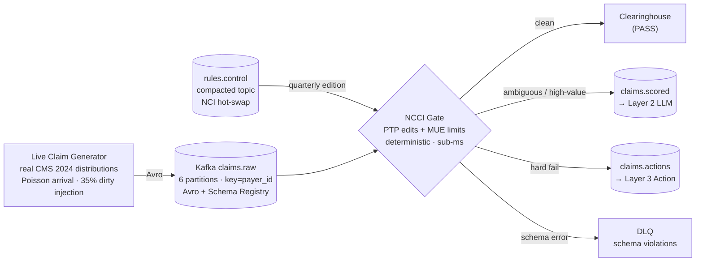

# Cleared: Agentic RCM Pre-Submission Prevention Pipeline

[](https://github.com/ericg1212/agentic-rcm-pipeline/actions/workflows/ci.yml)
[](https://codecov.io/gh/ericg1212/agentic-rcm-pipeline)
[](https://www.python.org/downloads/)
[](https://kafka.apache.org/)
[](https://snowflake.com)
[](https://www.getdbt.com/)
[](https://anthropic.com)

**By [Eric Grynspan](https://www.linkedin.com/in/ericgrynspan/)** &nbsp;·&nbsp; [Portfolio](https://ericg1212.github.io) &nbsp;·&nbsp; [← Trust but Verify](https://github.com/ericg1212/ai-healthcare-pipeline)

---

## Portfolio Arc

Denied classified denials retrospectively. Trust but Verify adds AI governance. Cleared prevents the denial before it happens.

| Pipeline | Focus | Status |
|---|---|---|
| [Denied](https://github.com/ericg1212/healthcare-claims-pipeline) | Retrospective denial classification — separate 27K systematic denials with an upstream fix from 229K documentation failures requiring a different intervention | Live |
| [Trust but Verify](https://github.com/ericg1212/ai-healthcare-pipeline) | Clinical AI governance — LLM enrichment + rules engine cross-validation, every routing decision explainable | Live |
| **[Cleared *(this project)*](https://github.com/ericg1212/agentic-rcm-pipeline)** | Real-time prior auth prevention — RAG-enhanced payer criteria matching at point of submission, streaming ingestion | Live — Layers 1–4 |

---

**Claim denials are one of healthcare's largest preventable revenue leaks, costing U.S. providers well over $100B a year in rework and write-offs.** This pipeline intercepts claims in real time — before they leave the practice — and prevents the two largest denial root causes: NCCI coding violations and prior authorization gaps. Every claim is scored against real NCCI edits and RAG-retrieved payer authorization criteria using Claude API tool-use. The system autonomously corrects, flags, or escalates — each action citing the governing rule in an immutable audit log. Prevention impact is measured, not estimated: a 10% holdout control arm makes the clean-claim-rate lift provable.

---

## What's Built (Layers 1–4)



**Layer 1 — Foundation:**
- Live stochastic generator sampling real 2024 CMS Provider Utilization distributions
- Deterministic NCCI PTP + MUE gate: `PASS` / `HARD_FAIL` / `AMBIGUOUS` — ~85% of claims never touch the LLM
- Compacted `rules.control` topic: NCCI quarterly editions hot-swapped without consumer downtime
- 10% holdout stamped at source (`is_holdout` in Avro schema) — control arm for provable ROI
- Snowflake RAW: 5 append-only tables including immutable `ACTION_LOG` and `ADJUDICATION_OUTCOMES`

**Layer 2 — Intelligence:**
- Claude API tool-use scorer: 5-tool loop (NCCI edit lookup, LCD policy, modifier check, payer history, submit decision), temperature=0, SHA-256 input hash for replay
- CARC enum enforced at schema boundary — hallucinated denial codes rejected before scoring
- Noise injection eval: wrong-diagnosis dirty claims pass the deterministic gate; LLM recovers via `get_lcd_policy` — proves LLM lift
- dbt staging (3 views) + `fct_claim_risk_scores` mart with holdout/intervention/deterministic cohort column for lift calculation

**Layer 3 — Action:**
- Tiered confidence-gated router: holdout bypass → kill-switch → escalation gate (risk ≥ 85) → 3-condition auto-correct → flag → pass
- 3-condition auto-correct gate: LLM recommended + confidence ≥ 0.92 + charge ≤ $500 — all three required (FCA defense)
- Immutable audit log: every action cites governing rule; escalation draft generated by agent, approved by human
- Kill-switch: single-lever drops all claims to FLAG; activates automatically on drift breach

**Layer 4 — Feedback Loop:**
- Adjudication outcome consumer on `adjudications.outcomes` Kafka topic — closes the pre-submission → payer → outcome loop
- Holdout lift calculator: intervention vs. control arm denial rates, absolute + relative lift, MIN_POWER_N=30 guard
- Drift monitor: rolling window vs. baseline denial rate, activates kill-switch on >20% relative drift
- Streamlit operational dashboard: kill-switch control, action distribution, lift analysis, drift status, audit log

---

## Stack

| Layer | Technology |
|---|---|
| Streaming | Apache Kafka 3.8.0 (KRaft — no ZooKeeper) |
| LLM | Claude API `claude-sonnet-4-6` · tool-use · temp=0 |
| Warehouse | Snowflake (RAW → STAGING → MART) |
| Transform | dbt |
| Quality | Great Expectations |
| Dashboard | Streamlit |
| Infra | Docker Compose |
| Language | Python 3.13 |

---

## Data Strategy

Every claim event composes from **CMS distributions, provider NPIs, and NCCI adjudication rules** — aggregate Medicare data only, no PHI:

| Element | Source |
|---|---|
| Claim substrate | CMS Medicare Physician & Other Practitioners 2024 — HCPCS frequencies, charge distributions, provider NPIs |
| Denial logic | NCCI PTP + MUE edits, 2026 Q3 quarterly CSV |
| Denial codes | X12/WPC CARC/RARC canonical enum |
| Denial rate baseline | CMS Transparency in Coverage PUF |

The generator composes novel claim events from these distributions — every denial still traces back to an actual Medicare adjudication rule.

---

## Quickstart

```bash
make up          # Kafka + Schema Registry + UI (http://localhost:8080)
cp .env.example .env && make install
make producer    # start live claim generator
make consumer    # start NCCI gate consumer
make test        # 85 tests
```

Download real NCCI quarterly CSVs from CMS and place in `data/ncci/`. Seed files included for dev.

---

## Architecture Decision Records

- [ADR-001: Kafka vs Kinesis vs micro-batch](docs/adrs/ADR-001-kafka-vs-alternatives.md)
- [ADR-002: Real distributions vs DE-SynPUF vs Synthea](docs/adrs/ADR-002-data-ground-truth.md)
- [ADR-003: Latency model and LLM trigger gate](docs/adrs/ADR-003-latency-llm-gate.md)

