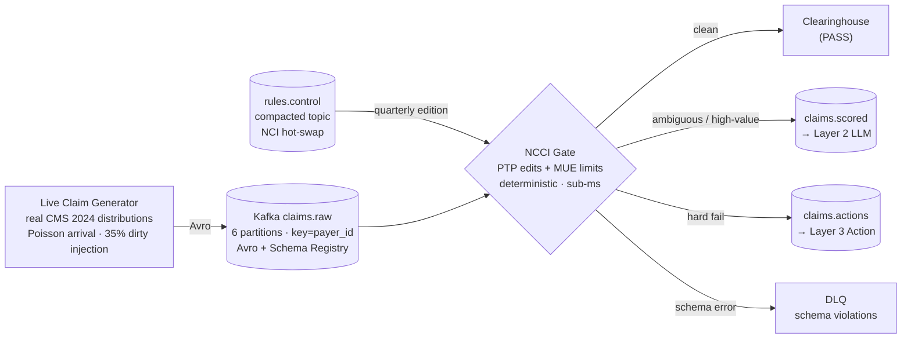

# Agentic RCM Pre-Submission Prevention Pipeline

[](https://github.com/ericg1212/agentic-rcm-pipeline/actions/workflows/ci.yml)
[](https://codecov.io/gh/ericg1212/agentic-rcm-pipeline)
[](https://www.python.org/downloads/)
[](https://kafka.apache.org/)
[](https://snowflake.com)
[](https://anthropic.com)

**Healthcare denials cost U.S. providers $262B annually in rework, resubmission, and write-offs.** This pipeline intercepts claims in seconds — before they leave the practice — scores each against real NCCI edits and Medicare coverage policy using Claude API tool-use, and autonomously corrects or routes the ones that would be denied. Every action cites the governing rule in an immutable audit log. Prevention impact is measured, not estimated: a 10% holdout control arm makes the clean-claim-rate lift provable.

---

## What's Built (Layer 1 — Foundation)



**Layer 1 delivers:**
- Live stochastic generator sampling real 2024 CMS Provider Utilization distributions — immune to "you're just replaying a CSV"
- Deterministic NCCI PTP + MUE gate with three-route decision: `PASS` / `HARD_FAIL` / `AMBIGUOUS` — ~85% of claims never touch the LLM
- Compacted `rules.control` topic: NCCI quarterly editions hot-swapped without consumer downtime
- 10% holdout stamped at the source (`is_holdout` in Avro schema) — control arm for provable ROI
- Snowflake RAW: 5 append-only tables including immutable `ACTION_LOG` and `ADJUDICATION_OUTCOMES`

---

## Stack

| Layer | Technology |
|---|---|
| Streaming | Apache Kafka 3.8.0 (KRaft — no ZooKeeper) |
| LLM | Claude API `claude-sonnet-4-6` · tool-use · temp=0 |
| Warehouse | Snowflake (RAW → STAGING → MART) |
| Transform | dbt |
| Quality | Great Expectations |
| Dashboard | Streamlit |
| Infra | Docker Compose |
| Language | Python 3.13 |

---

## Data Strategy

No PHI. No beneficiary-level data. No DUA required. Realness lives in the **policy and distributions**:

| Element | Source | Real? |
|---|---|---|
| Claim substrate | CMS Medicare Physician & Other Practitioners 2024 — HCPCS frequencies, charge distributions, real NPIs | ✓ |
| Denial logic | NCCI PTP + MUE edits, 2026 Q3 quarterly CSV | ✓ |
| Denial codes | X12/WPC CARC/RARC canonical enum | ✓ |
| Denial rate baseline | CMS Transparency in Coverage PUF | ✓ |

The generator composes novel claim events from these real distributions — the only synthetic atom. Every denial traces to a real Medicare adjudication rule.

---

## Quickstart

```bash
make up          # Kafka + Schema Registry + UI (http://localhost:8080)
cp .env.example .env && make install
make producer    # start live claim generator
make consumer    # start NCCI gate consumer
make test        # 14 tests
```

Download real NCCI quarterly CSVs from CMS and place in `data/ncci/`. Seed files included for dev.

---

## Architecture Decision Records

- [ADR-001: Kafka vs Kinesis vs micro-batch](docs/adrs/ADR-001-kafka-vs-alternatives.md)
- [ADR-002: Real distributions vs DE-SynPUF vs Synthea](docs/adrs/ADR-002-data-ground-truth.md)
- [ADR-003: Latency model and LLM trigger gate](docs/adrs/ADR-003-latency-llm-gate.md)

---

## Portfolio Arc

P2 → Healthcare Claims Intelligence (Synthea, architecture proof) · P3 → Clinical AI Governance (LLM-as-Judge, enrichment pipeline) · **P4 → this repo** (real CMS data, streaming, fully agentic)
