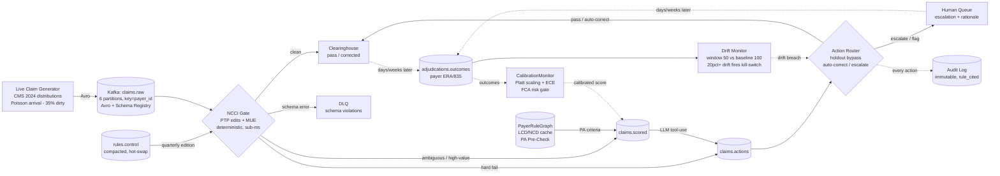

# Cleared: Agentic RCM Pre-Submission Prevention Pipeline

[](https://github.com/ericg1212/agentic-rcm-pipeline/actions/workflows/ci.yml)
[](https://github.com/ericg1212/agentic-rcm-pipeline/actions/workflows/codeql.yml)
[](https://github.com/ericg1212/agentic-rcm-pipeline/releases)
[](https://kafka.apache.org/)

[](https://snowflake.com)
[](https://www.getdbt.com/)
[](https://docs.docker.com/compose/)
[](https://www.python.org/downloads/)


**By [Eric Grynspan](https://www.linkedin.com/in/ericgrynspan/)** &nbsp;·&nbsp; [← Trust but Verify](https://github.com/ericg1212/ai-healthcare-pipeline)

> **License notice:** Source-available for review and evaluation only. Copyright © 2026 Eric Grynspan — all rights reserved. No use, copying, modification, redistribution, or inclusion in AI/ML training datasets without written permission. See [LICENSE](LICENSE).

---

Denied classifies denials retrospectively. Trust but Verify adds AI governance. Cleared prevents the denial before it happens.

| Pipeline | Focus | Status |
|---|---|---|
| [Denied](https://github.com/ericg1212/healthcare-claims-pipeline) | Retrospective denial classification — separate 27K systematic denials with an upstream fix from 229K documentation failures requiring a different intervention | Live |
| [Trust but Verify](https://github.com/ericg1212/ai-healthcare-pipeline) | Clinical AI governance — LLM enrichment + rules engine cross-validation, every routing decision explainable | Live |
| **[Cleared *(this project)*](https://github.com/ericg1212/agentic-rcm-pipeline)** | Real-time prior auth prevention — in-memory payer criteria matching at point of submission, streaming ingestion | Live |

---

**Claim denials are one of healthcare's largest preventable revenue leaks, costing U.S. providers well over $100B a year in rework and write-offs.** This pipeline intercepts claims in real time — before they leave the practice — and prevents the two largest denial root causes: NCCI coding violations and prior authorization gaps. Every claim is scored against real NCCI edits and in-memory LCD/NCD payer authorization criteria using LLM tool-use. The system autonomously corrects, flags, or escalates — each action citing the governing rule in an immutable audit log. Prevention impact is measured, not estimated: a 10% holdout control arm makes the clean-claim-rate lift provable.

---

## Cost of Intelligence

| Metric | Value |
|---|---|
| API cost per claim scored | **$0.003** (claude-sonnet-4-6, ~200 input / 80 output tokens) |
| Median Medicare denial value prevented | **$150** |
| ROI on analysis cost | **50,000×** |
| LLM touch rate | **~15%** of claims (deterministic gate absorbs the rest) |

Every scored claim logs its token usage and cost to Snowflake `RAW.LLM_SCORING_RESULTS` — the numbers above come from the actual usage log. The gate is the cost control: 85% of claims are adjudicated deterministically in under a millisecond, making LLM spend proportional to genuine ambiguity.

---

## Architecture



## What's Built

**Streaming Ingestion & Deterministic Gate**
- Live stochastic claim generator sampling real 2024 CMS Provider Utilization distributions
- NCCI PTP + MUE gate resolves ~85% of claims deterministically in under a millisecond — only genuine ambiguity reaches the LLM
- Compacted `rules.control` topic hot-swaps NCCI quarterly editions with zero consumer downtime
- At-least-once delivery with effect dedup; poison messages dead-letter with their raw bytes and never wedge a partition
- 10% holdout arm randomized at the provider level — deterministic NPI ranking, stable across restarts and replays
- Snowflake RAW: 5 append-only tables, including immutable `ACTION_LOG` and `ADJUDICATION_OUTCOMES`

**LLM Scoring**
- 5-tool LLM loop (NCCI edit lookup, LCD policy, modifier check, payer history, PA pre-check) at temperature 0, with bounded retry and a deterministic fallback
- `PayerRuleGraph` in-memory LCD/NCD cache backed by Snowflake `RAW.PAYER_RULES` — sub-10ms rule retrieval, daily LCD / weekly NCD ingestion
- PA pre-check surfaces prior-auth risk (CARC CO-197) at point of scoring, governed by CMS-0057-F
- CARC enum enforced at the schema boundary — hallucinated denial codes rejected before scoring
- Noise-injection eval proves LLM lift: wrong-diagnosis claims that pass the deterministic gate are recovered via LCD policy lookup
- dbt staging + `fct_claim_risk_scores` mart, keyed by holdout / intervention / deterministic cohort

**Action & Safety**
- Tiered router: holdout bypass → kill-switch → escalation gate → auto-correct gate → flag → pass
- Auto-correct requires all three: LLM-recommended + calibrated confidence ≥ 0.92 + charge ≤ $500 — the conditions map directly to FCA liability elements
- `CalibrationMonitor` (Platt scaling + ECE) corrects systematic over/under-confidence; the FCA risk gate blocks auto-correct below the calibrated floor
- Great Expectations contract on every LLM output — score bounds, CARC membership, action enum — rejects malformed outputs before routing
- Immutable audit log: every action cites its governing rule; escalations carry the full LLM rationale for human sign-off
- Distributed kill-switch on a compacted control topic — activate anywhere, every replica degrades to flag-only within seconds

**Feedback & Measurement**
- `adjudications.outcomes` consumer closes the pre-submission → clearinghouse → payer → ERA loop, every outcome keyed by arm
- Holdout lift calculator: intervention vs. control denial rates, absolute + relative lift, minimum-power guard before reporting
- Drift monitor: rolling 50-outcome window vs. 100-outcome baseline; >20% relative change fires the kill-switch
- DBSCAN denial clustering surfaces recurring patterns that feed upstream prompt refinement
- Dagster-invocable self-healing sensors detect denial-rate spikes and trigger automated re-scoring before human escalation
- Streamlit ops dashboard: kill-switch control panel, action distribution, live lift, drift status

---

## Architecture Decisions (ADRs)

| Decision | Why | ADR |
|---|---|---|
| Kafka over Kinesis / micro-batch | Pre-submission interception needs event-time streaming with per-payer ordering; compacted topics enable zero-downtime rule hot-swaps | [ADR-001](docs/adrs/ADR-001-kafka-vs-alternatives.md) |
| Real CMS distributions over DE-SynPUF / Synthea | No public dataset carries claim-level denial codes — realness lives in the policy and distributions, not the rows | [ADR-002](docs/adrs/ADR-002-data-ground-truth.md) |
| Deterministic gate in front of the LLM | The gate resolves the confident majority sub-millisecond; only ambiguity pays the ~300ms LLM call | [ADR-003](docs/adrs/ADR-003-latency-llm-gate.md) |
| Confidence-gated autonomy: 3-condition gate + Platt calibration | Cited rule, calibrated confidence floor, and dollar ceiling map one-to-one onto FCA liability elements | [ADR-004](docs/adrs/ADR-004-confidence-gated-autonomy.md) |
| Feedback & measurement: drift windows + provider-level holdout | 50-outcome windows catch real drift without noise; cluster randomization keeps the control arm uncontaminated | [ADR-005](docs/adrs/ADR-005-feedback-and-measurement.md) |
| Payer rule intelligence: Snowflake + cache, PA in the tool loop | Versioned storage for the audit trail, in-memory serving for the hot path, one LLM call for one complete risk picture | [ADR-006](docs/adrs/ADR-006-payer-rule-intelligence.md) |
| Delivery & control plane: at-least-once + compacted kill-switch topic | One claim, one action via effect dedup; the single-lever guarantee survives horizontal scaling | [ADR-007](docs/adrs/ADR-007-delivery-and-control-plane.md) |

---

## Stack

| Layer | Technology | Role |
|---|---|---|
| Streaming | Apache Kafka 3.8.0 (KRaft — no ZooKeeper) | Event-time claim interception, per-payer ordering; compacted control topics for rule hot-swap + kill-switch |
| LLM | Anthropic API (`claude-sonnet-4-6`) · tool-use · temperature 0 | 5-tool scoring loop for the ambiguous ~15% behind the deterministic gate |
| Warehouse | Snowflake (RAW → STAGING → MART) | Append-only audit tables, versioned payer rules, LLM usage log |
| Transform | dbt | Staging + `fct_claim_risk_scores` mart, keyed by holdout / intervention / deterministic cohort |
| Quality | Great Expectations | Contract on every LLM output — score bounds, CARC membership, action enum |
| Dashboard | Streamlit | Ops panel — kill-switch control, action distribution, live lift, drift status |
| Infra | Docker Compose | Kafka KRaft + Schema Registry local stack |
| Language | Python 3.13 | Generator, consumers, tool loop, routers, monitors |

---

## Data Strategy

Every claim event composes from **CMS distributions, provider NPIs, and NCCI adjudication rules** — aggregate Medicare data only, no PHI:

| Element | Source |
|---|---|
| Claim substrate | CMS Medicare Physician & Other Practitioners 2024 — HCPCS frequencies, charge distributions, provider NPIs |
| Denial logic | NCCI PTP + MUE edits, 2026 Q3 quarterly CSV |
| Denial codes | X12/WPC CARC/RARC canonical enum |
| Denial rate baseline | CMS Transparency in Coverage PUF |

The generator composes novel claim events from these distributions — every denial still traces back to an actual Medicare adjudication rule.

---

## Testing

```bash
make test        # 251 tests
```

251 tests spanning all four agent layers: perception (claim consumer, NCCI gate, DLQ), reasoning (LLM scorer, calibration, noise-injection eval), action (tiered router, kill-switch store, PA pre-check), and feedback (drift sensors, denial clustering, outcome handling) — plus the Great Expectations scoring-suite contract, the payer rule graph, and the live claim generator.

---

## Project Structure

```
src/
├── generator/        # live stochastic claim generator + Kafka producer
├── consumer/         # claim consumer, NCCI gate, DLQ handling        (Perception)
├── reasoning/        # LLM scorer, tool loop, prompt versioning       (Reasoning)
├── action/           # tiered router, corrections, audit, kill-switch (Action)
├── feedback/         # outcomes, lift, drift, calibration, clustering (Feedback)
├── intelligence/     # payer rule graph + LCD/NCD ingestion
├── eval/             # noise-injection evaluation harness
├── validation/       # Great Expectations scoring suite
├── dagster_jobs/     # self-healing sensors
├── schemas/          # Avro schemas (claims.raw)
└── config/           # typed settings
app/                  # Streamlit ops dashboard
dbt/                  # staging + mart models over Snowflake
docs/adrs/            # 7 architecture decision records
snowflake/            # RAW-layer DDL
infra/                # Docker Compose (Kafka KRaft + Schema Registry)
tests/                # 251 tests
```

---

## Quickstart

```bash
make up          # Kafka + Schema Registry + UI (http://localhost:8080)
cp .env.example .env && make install
make producer    # start live claim generator
make consumer    # start NCCI gate consumer
make test        # 251 tests
```

Download real NCCI quarterly CSVs from CMS and place in `data/ncci/`. Seed files included for dev.

---

## Author

**Eric Grynspan** — Data Engineer · Financial Services & Healthcare

[](https://www.linkedin.com/in/ericgrynspan/)
